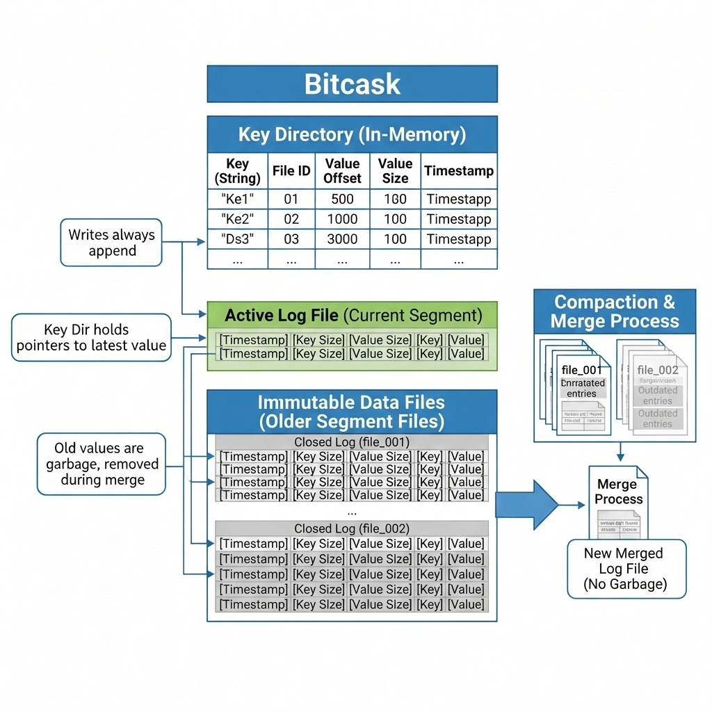

# CaskDb

CaskDB is a fast, embeddable key-value database written in Go, built on the Bitcask model. It's designed to be simple, predictable,
and blazingly fast for workloads that fit in memory.

The core idea behind it is — write data sequentially to a write-ahead log, maintain an in-memory index for instant lookups, and
achieve single-disk-IO operations for reads, writes, and deletes.

## Features

- Fast read/write/delete operations (single disk I/O per operation).
    - Uses write-ahead log for durability.
    - In-memory B-Tree index for instant lookups.
- Batch operations with atomicity guarantees.
- TTL support for automatic key expiration.
- Iterator for sequential traversal with prefix filtering.
- Watch mechanism for real-time change notifications.
- Merge/compaction to reclaim disk space.
- Hint files for fast database recovery on startup.

# Design Overview



> we don't have timestamps of when the data was written but do have expiry on the records; see below for the actual storage format.

#### Log Record Format

```
+-------------+-------------+-------------+--------------+---------------+---------+---------+
|    type     |   batchId   |   key size  |    val size  |     expire    |   key   |   val   |
|     1       |  varint(10) |  varint (5) |   varint (5) |   varint (10) |   var   |   var   |
+-------------+-------------+-------------+--------------+---------------+---------+---------+
                                                       
BatchId  = Identifies which batch this record belongs to, and also helps with atomicity.
Expire   = Unix nanosecond timestamp for TTL (0 = no expiration)
Type     = LogRecordNormal, LogRecordDeleted, or LogRecordBatchFinished
Key/Val  = Actual data
```

CaskDB follows the Bitcask architecture: writes are appended to an active log segment, and an in-memory index maps each key to its
position in the log. This design trades memory for speed — all keys must fit in RAM, but operations are extremely fast.

### Key Components

- **Write-Ahead Log (WAL):** Stores all data in append-only segment files.
- **In-Memory Index:** B-Tree structure mapping keys to file positions.
- **Batch**: Groups operations for atomic commits.
- **Iterator:** Efficient sequential scans with filtering.
- **Merge Process:** Periodic compaction to remove stale data.

## Getting Started

```go
package main

import (
	"fmt"
	"time"

	cask "github.com/srivastavcodes/caskdb"
)

func main() {
	opts := cask.DefaultOptions
	opts.WatchQueueSize = 10

	db, err := cask.Open(opts)
	if err != nil {
		panic(err)
	}
	defer func() { _ = db.Close() }()

	// Simple put and get
	_ = db.Put([]byte("name"), []byte("Alice"))
	val, _ := db.Get([]byte("name"))
	fmt.Printf("name: %s\n", val)

	// Put with TTL
	_ = db.PutWithTTL([]byte("session"), []byte("xyz123"), 5*time.Minute)

	// Batch operations (atomic)
	batch := db.NewBatch(cask.DefaultBatchOptions)
	_ = batch.Put([]byte("key1"), []byte("value1"))
	_ = batch.Put([]byte("key2"), []byte("value2"))
	_ = batch.Delete([]byte("old-key"))
	_ = batch.Commit()

	// Iterate over keys
	iter := db.NewIterator(cask.DefaultIteratorOptions)
	defer iter.Close()

	for iter.Rewind(); iter.Valid(); iter.Next() {
		item := iter.Item()
		fmt.Printf("key=%s, value=%s\n", item.Key, item.Val)
	}
	// Watch for changes
	watchCh, _ := db.Watch()

	go func() {
		for event := range watchCh {
			fmt.Printf("Event: %v on key %s\n", event.Action, event.Key)
		}
	}()
	time.Sleep(5 * time.Second)
}

```

### How it works (on a high level)

- All writes are appended sequentially to the active segment file.
- Each write updates the in-memory B-Tree index with the key and log position.
- Reads fetch the position from the index and perform a single disk read.
- Deletes write a tombstone record and remove the key from the index.
- Batch operations are buffered in memory, then written atomically with a batch-finished marker.
- Expired keys are lazy-deleted during reads or via background cleanup.
- Merge/compaction rewrites live data to new segments (with isolation semantics) and updates the index.
- Hint files store key-position mappings for fast index rebuilding on startup.

### Performance Characteristics

#### Strengths:

- Single disk I/O for reads/writes (when keys fit in RAM).
- Extremely fast writes (append-only, no seek).
- O(log N) lookups via B-Tree index.
- Efficient batch operations.

#### Limitations:

- All keys must fit in memory.
- Deleted/updated data persists until merge.
- Database size grows until merge/compaction runs.
- Not suitable for datasets with billions of keys.

## Status

This is primarily a learning project built to understand log-structured storage and the Bitcask architecture. However, it's fully
functional with features like atomic batches, TTL support, and compaction.

It's suitable for educational purposes, prototyping, and real use cases where your dataset fits in RAM. The API may evolve over time.

**Found an issue or have an improvement?** Pull requests are welcome!
